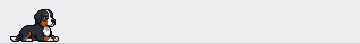
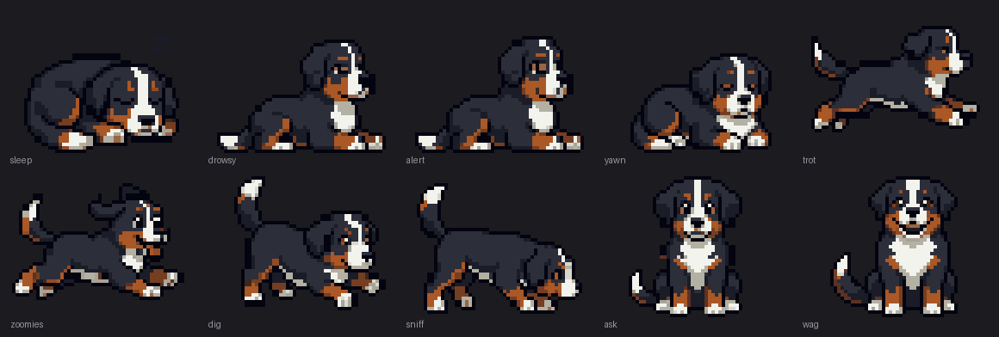

# Daisy Status Bar

A fork of [m1ckc3s/claude-status-bar](https://github.com/m1ckc3s/claude-status-bar) that adds a
Bernese Mountain Dog as a fourth menu-bar animation style. She reacts to what Claude Code is
actually doing — sleeping when idle, digging when editing files, tearing about when a command runs,
and sitting with a paw up when Claude needs your permission.

**Actual size, in a menu bar:**





Everything upstream still works. Daisy is added alongside Claude Spark, Claude Code and Crab
Walking rather than replacing them, so you can switch back from **Animation** in the menu.

## The animations

Ten clips, 35 frames, all 16-bit pixel art in a Stardew Valley / SNES idiom.

| | | |
|---|---|---|
| **sleep** — idle over 2 min<br> | **drowsy** — idle under 2 min<br> | **alert** — random idle beat<br> |
| **yawn** — random idle beat<br> | **trot** — thinking<br> | **zoomies** — running a command<br> |
| **dig** — editing or writing<br> | **sniff** — reading or searching<br> | **ask** — awaiting permission<br> |
| **wag** — turn complete<br> | | |

## What she does when

Every trigger is a signal the upstream app already tracked. Routing is on the **raw tool name** from
the hook payload rather than the prettified label, because the "thinking words" setting rewrites that
label out from under you.

| App state | Signal | Daisy |
|---|---|---|
| Thinking | `state == "thinking"` | trots along happily |
| Running a command | tool `Bash` | full-speed zoomies |
| Editing / writing | `Edit` `Write` `MultiEdit` `NotebookEdit` | digs, dirt flying |
| Reading / searching | `Read` `Grep` `Glob` `WebFetch` `WebSearch` | nose down, tracking a scent |
| Any other tool | `Task`, `TodoWrite`, anything new | trots (fallback) |
| Awaiting your permission | permission state | sits, head tilted, one paw raised |
| Turn complete | active → idle edge | wags, then settles |
| Idle under 2 min | — | lies down, blinking |
| Idle over 2 min | — | curls up asleep with a floating Z |
| Every 35–100 s idle | random | ears perk, or a big stretch and yawn |

Both colour modes are supported. **Orange** draws her full tri-colour sprite; **System** builds a
template image where her dark pixels become ink and her white blaze, chest bib, paws and tail tip
punch through as negative space, so she still reads as a specific dog in monochrome.

## Build and run

```bash
./build.sh                                # universal binary, ad-hoc signed
open "build/Claude Status Bar.app"
```

Then pick **Animation → Daisy**. First launch wires up the Claude Code hooks, exactly as upstream
does.

## Tools

```bash
./tools/preview.sh          # GUI viewer: every clip, both colour modes, zoomed and at true size
./tools/cycle-states.py     # drive the real menu bar through all ten states
./tools/drivertest.sh       # headless checks of the state machine, on a virtual clock
./tools/make_showcase.py    # regenerate the GIFs on this page from the built frames
```

`preview.sh` compiles against the real frame data and renderer, so a clip that looks wrong there is
wrong in the app. `cycle-states.py` writes a synthetic session file into
`~/.claude/statusbar/state.d/` — the same thing a real hook event does — so the app reacts genuinely
rather than being driven from inside.

## Regenerating the art

The sprite sheets in [`art/raw/`](art/raw) are the source of truth. To change a clip: regenerate that
sheet from its prompt in [`DAISY-PROMPTS.md`](DAISY-PROMPTS.md), save it over the same filename, then

```bash
python3 -m venv .venv && .venv/bin/pip install Pillow
.venv/bin/python tools/make_frames.py     # -> Sources/DaisyFrames.swift + previews
./build.sh
```

The pipeline recovers the native pixel grid by sampling block centres (the generator delivers a
100×100 canvas upscaled to ~1024 and JPEG-softened, so resampling would smear it), keys the magenta
background, splits and re-aligns the frames, builds one shared palette, and emits base64 PNGs.

[`art/superseded/`](art/superseded) keeps the rejected takes, each named for how it failed — pointy
ears, duplicate poses, a gallop with no compression phase. They are more useful than they look.

## Documentation

- **[DAISY.md](DAISY.md)** — this page
- **[DAISY-PLAN.md](DAISY-PLAN.md)** — architecture, alignment rules, tuning knobs, known rough edges
- **[DAISY-PROMPTS.md](DAISY-PROMPTS.md)** — the image-generation prompts, and what was learned
  getting them to work

The two supporting docs are unusually detailed on purpose. The art is generated externally and most
of the reasoning behind each parameter is not recoverable from reading the code. A few of the more
transferable findings:

- **Describe every frame separately.** Describing an animation as a concept ("legs move through a
  trot") produced six frames containing three distinct poses, two of them 2% apart.
- **Give abstract motion a concrete drawable proxy.** "Tilt her head" was ignored twice; "the white
  blaze must run at a strong diagonal instead of straight up and down" worked first try.
- **Never align sprites on their centre of mass.** Whatever moves drags the centroid with it, so the
  alignment compensates for the motion and cancels it.
- **One motion at a time.** At menu-bar size a sweeping tail *and* a bouncing body read as noise.
- **Light-coloured particles vanish** in template mode — a hole needs surrounding ink to read as a
  hole. Ask for dark dust.

## Credits

Upstream [claude-status-bar](https://github.com/m1ckc3s/claude-status-bar) by
[@m1ckc3s](https://github.com/m1ckc3s), MIT licensed — all of the status-bar machinery, hook
integration and lifecycle handling is theirs. This fork only adds the dog.

Daisy is a real Bernese Mountain Dog. Her sprites were generated with Grok from the prompts in
`DAISY-PROMPTS.md`.
