<h1 align="center">🐶 Daisy Status Bar</h1>

<p align="center">
  <b>A Bernese Mountain Dog who lives in your macOS menu bar<br>
  and reacts to what Claude Code is actually doing.</b>
</p>

<p align="center">
  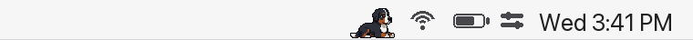
</p>

<p align="center">
  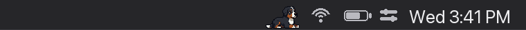
</p>

<p align="center"><sub>
  Shown at actual size. One logical pixel lands on one device pixel, so she stays crisp on Retina.
</sub></p>

## Install

```bash
brew install wbuf81/daisy/daisy-status-bar && open -a "Daisy Status Bar"
```

That's it. She builds from source on your own Mac, so it takes a minute or two rather than seconds,
and needs Xcode Command Line Tools (`xcode-select --install` if you haven't got them). The upside:
nothing to download and no Gatekeeper warning to click past, because an app compiled locally is
never quarantined.

**The `open` at the end matters** — that first launch is what installs the Claude Code hooks. Then
start or continue a `claude` session and she'll appear.

If she vanishes a few seconds later with no session running, that's correct, not a failed install:
she self-quits when nothing is live, and comes back on her own.

```bash
brew upgrade wbuf81/daisy/daisy-status-bar   # update
```

<details>
<summary>Uninstalling</summary>

```bash
node "$(brew --prefix daisy-status-bar)/Daisy Status Bar.app/Contents/Resources/uninstall.js"
brew uninstall daisy-status-bar
```

The first line removes only Daisy's own hook entries from `~/.claude/settings.json` — brew can't
edit that file, since it's shared with Claude Code itself. The second removes the app.
</details>

## She's reacting, not just animating

Every clip is wired to real Claude Code state. You can tell what's happening without looking away
from what you're doing — and you can tell **the moment she needs you**, because she sits down and
puts a paw up.

<p align="center">
  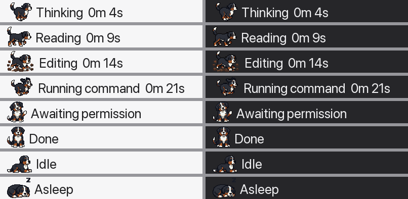
</p>

| | | | | |
|:---:|:---:|:---:|:---:|:---:|
| 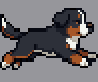 | 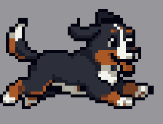 | 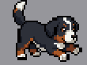 | 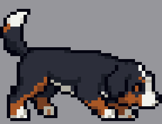 | 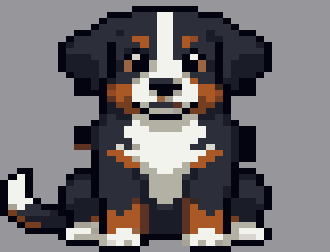 |
| **thinking** | **running a command** | **editing a file** | **reading / searching** | **awaiting permission** |
| 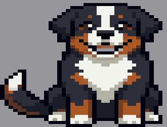 | 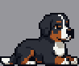 | 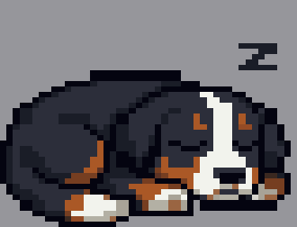 | 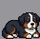 | 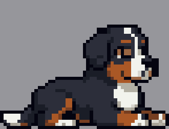 |
| **turn complete** | **idle** | **idle 2 min+** | **stretching** | **ears up** |

<sub>Above: roughly double menu-bar scale, so you can actually see her. Ten hand-tuned clips —
she goes drowsy after a minute, falls asleep after two, and stretches or perks her ears at random
so she never loops like a GIF.</sub>

Daisy is a fourth animation style, so the Claude Spark, crab and web icons are all still in the
menu. She has her own bundle id and hooks directory too, which means she installs **alongside**
upstream's app rather than replacing it — run both, or either, or neither.

**Full details, the state map, and how the art was made: [DAISY.md](DAISY.md)**

---

<sub>Everything below is the upstream README from
[m1ckc3s/claude-status-bar](https://github.com/m1ckc3s/claude-status-bar), unchanged.
⚠️ <b>Its Install section installs UPSTREAM's app, not Daisy.</b> <code>brew install --cask
claude-status-bar</code> gets you m1ckc3s's build with no dog in it, and its Releases link points
at upstream's DMGs. Use the command above for Daisy.</sub>

---
A tiny macOS menu bar app that shows **Claude Code's live status**: an animated Claude icon while it's thinking or running a tool, a yellow dot when it's awaiting your permission, and the elapsed time of the current turn. Lightweight, no window, no dock icon, no usage dashboards.

Built so you can tab away during a long "thinking" stretch and still see, at a glance, whether Claude is working, waiting on you, or done.


## Install

### Homebrew (recommended)

```bash
brew install --cask claude-status-bar && open -a "Claude Status Bar"
```

The one launch at the end matters: it wires up the Claude Code hooks automatically. After that it starts itself whenever Claude Code runs.

**Already using the app from the DMG?** The same command switches you to Homebrew. Your settings and hooks carry over, and the old copy cleans itself up on first launch. Full details, edge cases, and the tested upgrade matrix: **[HOMEBREW.md](HOMEBREW.md)**.

> [!IMPORTANT]
> **Updated (or installed) mid-session?** Sessions already open appear the next time they do something (a prompt or a tool call). Starting a new `claude` session also works.

### DMG

*Signed and notarized by Apple*

1. Download the latest `ClaudeStatusBar.dmg` from [Releases](../../releases).
2. Open it and drag **Claude Status Bar** into Applications.
3. Launch it once. On first launch it wires up the Claude Code hooks for you automatically.
4. Start a new Claude Code session, the icon appears whenever Claude Code is running.

## Updating

The menu tells you when an update is ready. Installed via brew, it shows **Update via brew** with a copy button (paste the command in your terminal); it appears once Homebrew can actually deliver the new version, which can lag a release by up to a day. Installed via DMG, **Update available** opens the releases page, plus a one-click **Switch to Homebrew** option.

Or just run `brew upgrade --cask claude-status-bar` (brew), or download the latest DMG and drag it into Applications (manual). Hooks refresh themselves on the next launch; nothing to run by hand. **Upgrading from 0.3.x via DMG? Launch the app once after dragging**, that's what retires the old-named copy ([details](HOMEBREW.md#faq--troubleshooting)).

## What it shows

- **Thinking / working** — the icon animates, with a live `1m 1s` timer.
- **Running a tool** — a short label (`Editing`, `Reading`, `Running command`, `Using tool`, …).
- **Awaiting permission** — a paused yellow dot, in both the CLI and the Desktop app.
- **Idle / done** — rests on the Claude logo.

Everything is controlled from the menu:

- **Show timer:** toggle the elapsed `1m 1s` clock.
- **Thinking words:** rotate a playful verb (`Manifesting…`, `Percolating…`) in place of `Thinking…`, like Claude Code (on by default).
- **Animation style:**
  - **Claude Spark**, the web/chat "morph" spark
  - **Claude Code**, the terminal glyph spinner
  - **Crab Walking**, a pixel-art Clawd crab that scuttles while Claude works
- **Icon color:** **Orange** or **System** (adaptive black/white). All three styles follow this setting: in System mode Crab Walking renders as a shaded monochrome silhouette that matches the menu bar.
- **Version and update:** the menu shows your current version and tells you when an update is ready (see [Updating](#updating)).

### Where it works

| Surface | Tracked? |
|---|---|
| Claude Code CLI (terminal) | ✅ |
| Claude Code Desktop — **Code** tab | ✅ |
| Cursor (Claude Code extension) | ✅ |
| Claude Desktop — **Chat/Cowork** tab | ❌ |

**Multi-session support.** When several Claude Code sessions run at once (multiple terminals, or a terminal plus the desktop app), the menu bar surfaces the highest-priority one: a session awaiting your permission is never hidden behind one that's thinking. The dropdown lists every live session. Precise per-tab focus is in progress: **[issue #19 →](https://github.com/m1ckc3s/claude-status-bar/issues/19)**.

## How it works

> [!NOTE]
> You don't open this app; it opens itself when a Claude Code session starts, and quits when none is running. The only manual launch is the very first one after install, to set up the hooks. Opened by hand with no session active, it quits again after a few seconds. That's normal.

The app is stateless. Claude Code fires hooks as it works; the app polls those updates and aggregates them across every live session into a single icon, a permission dot if one needs you, animating if any session is working, resting when all are idle. It launches itself when Claude Code opens and quits when nothing's running, so there's nothing to manage.

The installer merges its hooks into `~/.claude/settings.json` (backing it up first), and the app's only network activity is a once-a-day update check against GitHub's and Homebrew's public APIs ([details](PRIVACY.md)).

## Requirements

- macOS 12+
- [Claude Code](https://claude.com/claude-code) (CLI or the Desktop app)
- Node.js

## Troubleshooting

Icon not appearing, vanishing on its own, or not animating when it should? See [Troubleshooting](TROUBLESHOOTING.md), most of it is expected behavior, not a bug.

## Uninstall

```bash
node "/Applications/Claude Status Bar.app/Contents/Resources/uninstall.js"   # removes only our hooks
brew uninstall --zap claude-status-bar                                       # removes the app + every file it created
```

Installed manually instead of via brew? Skip the second line and drag the app to the Trash.

## Acknowledgements

I built this for myself, then open-sourced it because other people might find it handy too, and I'm genuinely thrilled that so many of you do. An extra thank-you to everyone who went the extra mile and contributed code, fixes, and ideas.

**[See the contributors →](ACKNOWLEDGEMENTS.md)**

## Trademark / Not Affiliated

This is an unofficial, open-source side project. **It is not affiliated with, endorsed by, or sponsored by Anthropic.** "Claude" and the Claude spark logo are trademarks of Anthropic, used here nominatively. This project is MIT licensed, but that covers the source code only and conveys no rights to Anthropic's trademarks or brand.

If I'm violating or impeding your trademark, Contact me on X ([@mickces](https://x.com/mickces))
This is a free side project; I'm not monetizing it.

## License

MIT
